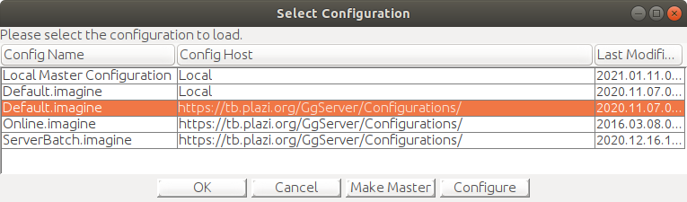
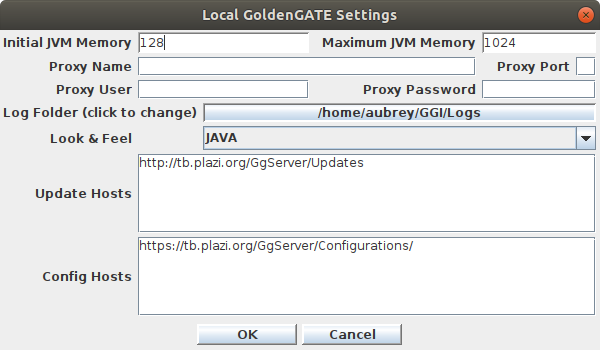
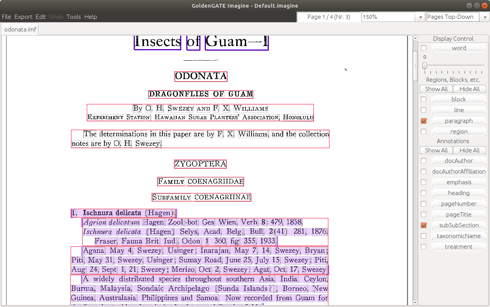

# Installation of GoldenGATE Imagine on Linux (Ubuntu 18.04)

## Install Java Runtime Environment (JRE)

My machine did not have Java installed, so I did the following:

* Install Java runtime
    ```
    sudo apt install default-jre
    ```

* Check which version of Java was installed:
    ```
    java --version
    ```

* This is what was installed on my machine:
    * openjdk 11.0.9.1 2020-11-04
    * OpenJDK Runtime Environment (build 11.0.9.1+1-Ubuntu-0ubuntu1.18.04)
    * OpenJDK 64-Bit Server VM (build 11.0.9.1+1-Ubuntu-0ubuntu1.18.04, mixed mode, sharing)

## Install GoldenGate Imagine

* Download GGI code::
    ```
    mkdir GGI
    cd GGI
    wget https://tb.plazi.org/GgServer/Downloads/GgImagine-Default.imagine.zip
    unzip *.zip
    rm *.zip
    ```
    
* Make all **jar** files exectutable:
    ```
    sudo find . -name "*.jar" -exec chmod +x -R {} \;
    ```
## Running GoldenGate Imagine

* Start GGImagine:
    ```
    java -jar GgImagineStarter.jar
    ```
    
* Allow GGI to update from the web. When the **Select Configuration** dialog appears, select **Default.imagine**. If more than one **Default.imagine** option is available, select the one with **https://tb.plazi.org/GgServer/Configurations/** in the **Config. Host** column. Now click the **Configure** button.


* Select **JAVA** for **Look & Feel**. This is important, GGI does not display proper color coding using the **SYSTEM** setting.


## Notes

* Training material for GGI, including screencasts, is available at https://github.com/plazi/community.


