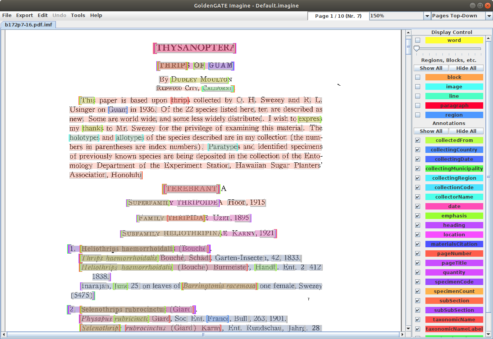

Installation of GoldenGATE Imagine on Linux (Ubuntu 18.04)
==========================================================

Install Java Runtime Environment (JRE)
--------------------------------------

My machine did not have Java installed, so I did the following:

* Install Java runtime
    ```
    sudo apt install default-jre
    ```

* Check which version of Java was installed:
    ```
    java --version
    ```

* This is what was installed on my machine:

    openjdk 11.0.9.1 2020-11-04
    OpenJDK Runtime Environment (build 11.0.9.1+1-Ubuntu-0ubuntu1.18.04)
    OpenJDK 64-Bit Server VM (build 11.0.9.1+1-Ubuntu-0ubuntu1.18.04, mixed mode, sharing)

Install GoldenGate Imagine
--------------------------

* Download GGI code::

    mkdir GGI
    cd GGI
    wget https://tb.plazi.org/GgServer/Downloads/GgImagine-Default.imagine.zip
    unzip *.zip
    rm *.zip
    
* Make all **jar** files exectutable::

    sudo find . -name "*.jar" -exec chmod +x -R {} \;

* Start GGImagine::

    java -jar GgImagineStarter.jar
    
* Allow GGI to update from the web. When the **Select Configuration** dialog appears, select **Default.imagine**. If more than one **Default.imagine** option is available, select the one with **https://tb.plazi.org/GgServer/Configurations/** in the **Config. Host** column.

* Configure GGI to use **Java** display mode (not **System**).

* Training material for GGI, including screencasts, is available at https://github.com/plazi/community.


Problems
--------

A couple of minor display problems are apparent.

* **FIXED BY SELECTING JAVA DISPLAY MODE:** There are no colored borders around buttons in the **Display Control** panel.

- The document display does not automatically update after an annotation is made. The document display updates when scrolled.


